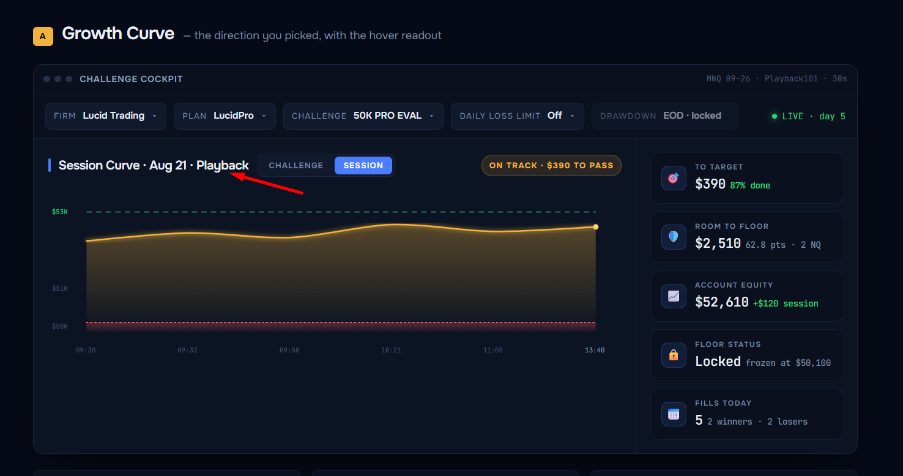

<h1 align="center">Funded Path</h1>

<p align="center">
  <strong>A NinjaTrader 8 add-on that tells you, while you are still in the trade, whether you are passing your prop-firm challenge — and what breaks first.</strong>
</p>
<p align="center">
  Your platform shows you a P&amp;L. It does not show you the end-of-day trailing floor that actually ends your account, because that number lives in the firm's rulebook, not in NinjaTrader. This window computes it from your own fills and puts it on screen next to the balance.
</p>

<p align="center">
  <a href="#the-floor-is-the-part-people-get-wrong">The floor</a> ·
  <a href="#status">Status</a> ·
  <a href="#install">Install</a> ·
  <a href="#the-rulebook-it-models">Rulebook</a> ·
  <a href="#limitations">Limits</a>
</p>

<p align="center">
  
  
  
  
  
  
</p>

<p align="center">
  
</p>
<p align="center"><em><strong>This is the approved design mockup, not a screenshot of the running add-on.</strong> The shipped window implements its layout, its tokens and its five rail cards. The numbers in it are illustrative — and so is one subline: the mockup renders <em>Room to floor</em> as <code>$2,510 · 62.8 pts · 2 NQ</code>, while the shipped card reads <code>$2,510 · floor $50,100 · equity basis</code>. There is no points-or-contracts conversion anywhere in the engine. The shipped window also adds a line the mockup has no room for — the binding-constraint line described below — and drops the green target line in Session view, where a challenge target thousands of dollars away squeezed a $200 day into 3.5% of the plot. A real capture replaces this image after the first Market Replay session.</em></p>

---

## The floor is the part people get wrong

A prop-firm challenge is arithmetic you are doing in your head while you trade. Most of it is easy:
the profit target is a fixed number, the daily loss limit is a fixed number. One rule is not, and it
is the one that ends accounts.

On a **50K LucidPro evaluation** your minimum balance is not $48,000. It is:

```
floor = max(closing balances so far) - 2,000
```

It **ratchets up every night you close green**, and it never comes back down. Close at $51,400 and
your floor is now $49,400 — a good day has quietly moved the line that kills you $1,400 closer.
That is the number nobody has on screen.

**But it stops.** Once a day closes at or above **$52,100**, the floor freezes at **$50,100** and
stops chasing you, permanently. From that moment you are trading against a locked $50,100 stop-out
and every dollar above it is yours to risk. Traders routinely do not know they have crossed that
line — or believe they have when they have not.

```
floor(day i) = min( max(SeededHwm, closes before day i) - MaxLoss , StartBalance + 100 )
```

`SeededHwm` is your start balance, or the peak end-of-day close you type in when you bind an account
mid-challenge — see [First run](#first-run). Bind on day one and it is just the start balance, and
the expression is the plain one.

That one expression is the whole product. Everything else on the window exists to put it in context:
how much room you have to it right now, how much is left to the target, and which of the two you hit
first. It is computed from **end-of-day closes only** — never from an intraday high — because that is
how Lucid computes it, and being wrong in either direction is expensive.

**And the window names which one.** Under the verdict there is one quiet line: whichever of
{profit target, floor, daily loss limit, consistency, trading days, payout minimum} has the least
slack right now, in dollars wherever a dollar figure exists —

```
Floor - $800 of room
Consistency - best day is $460 over the 40% cap; payout blocked
Trading days - 2 more days needed
```

The verdict pill is the answer; this line is why. On the funded phase it also carries the
consistency readout — `best day $1,240 vs $980 cap` — because the rail's fifth card is already spent
on the *other* payout gate, the day count.

---

## Status

| Layer | State |
|-------|-------|
| **Engine** (`Engine/`) | Complete. Pure C# 7.3, deterministic, zero NinjaTrader references. **69 unit tests passing.** |
| **NT8 add-on** (`NinjaTrader/`) | Built. Compiles clean through the full-tree gate (`tools/verify-compile.sh`). **Not yet exercised in a live Market Replay session** — that pass is what replaces the hero image above. |
| **Firms modelled** | **One: Lucid Trading, LucidPro** — all four sizes, all three phases. MyFundedFutures, Apex and Topstep appear in the dropdown greyed out and labelled "not modelled yet". They are placeholders, not rulebooks. |
| **Rule fidelity** | The evaluation phase carries **no open disagreement**: every value is verified against Lucid's own help centre, except the 25K daily loss limit, which is settled from the trader's own dashboard. **Four are still open** — three in the funded and live phases, one cross-phase (whether unrealized P&L counts against the floor). All four ship as specified and all are surfaced in the window's warning block, which prints the first six warnings and carries the whole list, in order, on hover; three more were closed on 2026-08-22. See [`docs/rules-sources.md`](docs/rules-sources.md). |

---

## Four states, and one safe default

NinjaTrader cannot tell an evaluation account from a funded account from your own personal live
money. All three arrive over a broker connection and are identical to `Account.Provider`. So the
cockpit does not guess.

**Every account starts `Untracked`.** It is measured by nothing and recorded nowhere until you
explicitly bind it to a challenge.

| State | How it is decided | Colour |
|-------|-------------------|--------|
| `Untracked` | **no binding — the default for every account** | `#4E5A74` |
| `Replay` | the account is a Playback account *and* it has a binding | `#F2B33D` |
| `Evaluation` | the binding says Evaluation | `#4A7DFF` |
| `LiveSim` | the binding says LiveSim (funded) | `#27D67B` |
| `Live` | the binding says Live | `#9B7BFF` |

**Your own live account can never be counted by accident.** There is no auto-detection to misfire,
and Untracked means untouched: an unbound account gets no event subscription, no balance read, no
scan of its executions and no file on disk. It appears in the account dropdown so that you can bind
it, and that is the whole of the cockpit's contact with it.

Ledgers never mix either: the ledger key is `Provider + "|" + AccountDisplayName`, so a Playback
rehearsal of your evaluation cannot move the real challenge's high-water mark. That exact
contamination is what corrupted an earlier tool's ledger; it is designed out here.

---

## What it reads, and what it never does

**Reads, per bound account:**

- `Account.Executions` → closed trades via `SystemPerformance.Calculate`, bucketed into ET trading
  days by each trade's **exit** time, to build the closing-balance series the floor trails on.
- `AccountItem.CashValue` for realized balance, `AccountItem.UnrealizedProfitLoss` for open P&L.
- The Playback clock (`Connection.PlaybackConnection.Now`) **when the bound account is itself a
  Playback account**, so a replay rehearsal ages against the replay's calendar — which can run at
  24x or sit paused — and not against your wall clock. Every other account ages against
  `Core.Globals.Now` even while Market Replay is connected, so a live account's trading day is never
  dated by somebody else's replay.

**Writes, in total: two XML files**, both under `Documents/NinjaTrader 8/FundedPath/`, both
written temp-then-swap — so each leaves a `.tmp` for the length of the write and keeps the previous
version as `.bak`.

- `bindings.xml` — your account bindings. One file, every account.
- `days-<provider>_<account>.xml` — **one per bound account**: the ledger of completed trading days.
  It is not a cache. `Account.Executions` holds the current session only, roughly three days, so
  after an NT8 restart a 20-day evaluation cannot be rebuilt from the platform at all. A green day
  that goes missing lowers the high-water mark, which lowers the floor, which reports *more* room
  than you have — the dangerous direction. Only the day in progress comes from executions;
  everything before it comes from this file. Deleting it is not a harmless reset.

**Never, under any circumstance:** places, modifies or cancels an order. This add-on is **read-only
on the account**. It has no order-entry surface, no auto-flatten and no kill switch — not a single
line of it touches NinjaTrader's order-submission API, and `tools/verify-compile.sh` fails the run if
one ever does: it greps `Engine/` and `NinjaTrader/` for `Submit`, `OrderAction.`, `CreateOrder`,
`StartAtmStrategy`, `AtmStrategyCreate`, `.Cancel(` and `.Change(`, with line comments stripped first
so the sentences describing the APIs it refuses to call cannot satisfy their own gate. That audit runs
*before* the compile, so tripping it fails the run without building anything. If you want something
that acts on the account, this is not it.

---

## The rulebook it models

LucidPro, all four sizes. Every value was read from the trader's own Lucid dashboard on 2026-08-22
and then re-checked line by line against Lucid's help centre. Where the two disagreed, the dashboard
value ships and the disagreement travels with it, onto the window. Every row's source and status is
in **[`docs/rules-sources.md`](docs/rules-sources.md)**, which is the authority — this table is the
summary.

### Evaluation — verified

| Size | Start | Profit target | Max loss | Floor locks at | Trail stops on a close of | Daily loss limit | Max size |
|------|-------|---------------|----------|----------------|---------------------------|------------------|----------|
| 25K  | 25,000  | 1,250 | 1,000 | 25,100  | 26,100  | 600 *(dashboard)* or OFF | 2 mini / 20 micro |
| 50K  | 50,000  | 3,000 | 2,000 | 50,100  | 52,100  | 1,200 or OFF | 4 mini / 40 micro |
| 100K | 100,000 | 6,000 | 3,000 | 100,100 | 103,100 | 1,800 or OFF | 6 mini / 60 micro |
| 150K | 150,000 | 9,000 | 4,500 | 150,100 | 154,600 | 2,700 or OFF | 10 mini / 100 micro |

No consistency rule and no minimum trading days — a one-day pass is allowed. The daily loss limit is
bought ON or OFF at checkout and is **soft**: hitting it locks trading until the next session, it
does not end the account.

The 25K's $600 is the one evaluation figure Lucid's own articles do not print — two of them say
"None" and only the funded overview shows $600. It is settled from the dashboard, and the catalog
still shows you the counter-evidence before you switch that toggle on.

### Funded and Live — partially unverified

| Field | Ships as | Confidence |
|-------|----------|------------|
| Funded max loss, floor lock, buffer | eval MLL, `start + 100`, `start + MLL + 100` | verified |
| Funded consistency | 40%, largest day vs total profit, blocks the **payout** not the account | verified |
| Profit split | 90/10 | verified |
| **Funded payout profit goal** | flat $500 | **conflicted** — Lucid publishes $250 / $500 / $750 / $1,000 by size |
| **Days to payout** | 3 | **conflicted** — Lucid's payout article says there is no fixed window at all |
| **LucidScale DLL** | 60% of peak EOD **profit** | verified against Lucid's own worked example — but **displayed only, never enforced.** The "peak EOD balance" wording on the dashboard is loose |
| **Fixed DLL below the initial trail** | the evaluation's amount for the size, and only if you bought the limit ON | **dashboard-implied** — Lucid publishes the amounts and the one-time checkout choice, but never states that the choice carries into the funded account |
| **The entire Live phase** | one set of numbers for all four sizes | **unverified.** Lucid scales every live figure by size and locks the floor at $100, not $2,000. Do not trade against these readouts |
| **Does unrealized P&L count against the floor?** | a setting, defaulting to **yes (strict)** | **assumption.** Lucid's wording says balance; the strict default warns you earlier. Flip it in the binding dialog |

Anything marked conflicted or unverified is labelled as such **on the window**, not only here — the
engine attaches the catalog's own note to the state and the window prints it. The warning block
shows the first six and appends "(+N more - hover for all)", whose tooltip carries every warning in
order, and the engine's computed alarms are ordered ahead of the rulebook's prose, so a live alarm is
never pushed off the bottom by a footnote. Part of the
cockpit's job is telling you what it does not know.

---

## Install

Funded Path ships as source, like every NinjaScript add-on.

1. Copy **both** `Engine/*.cs` and `NinjaTrader/*.cs` **flat** into:

   ```
   Documents/NinjaTrader 8/bin/Custom/AddOns/FundedPath/
   ```

   Both folders' files go into that one folder, with no sub-folders. NinjaTrader compiles every `.cs`
   under `bin/Custom` into a single assembly, so the directory split in this repository is for
   humans — the engine is kept NinjaTrader-free so the test project can compile it, and that
   separation has no meaning once the files are deployed.

2. Open the **NinjaScript Editor** in NinjaTrader and press **F5** to compile.

3. **Control Center → New → Funded Path.**

Requires NinjaTrader 8. No NuGet packages, no DLLs, no external dependencies — persistence uses
`System.Xml.Linq`, which ships with the platform.

## First run

1. **Bind an account.** Pick your NT8 account and tell the cockpit what it is: firm, plan, size,
   phase. Nothing is measured until you do, and nothing but the accounts you bind is ever touched.
2. **Pick the challenge.** Size and phase set the whole rulebook — target, max loss, floor lock,
   buffer. Set the daily-loss-limit toggle to match what you actually bought at checkout.
3. **If the challenge did not start today, type in your highest end-of-day close.** The day series
   is rebuilt from `Account.Executions`, and NinjaTrader keeps only the current session there —
   roughly three days. Bind a 50K evaluation on day 12 and the platform can tell the cockpit nothing
   about days 1 to 9: the high-water mark would restart from $50,000 and the floor would read
   **$2,000 lower than the real one**, which is the direction that gets accounts closed. So the
   binding dialog asks for the peak close you have already made, previews the floor it produces while
   you type, and stores it with the binding: the engine starts its high-water mark there. Leave it
   empty only when day one is today.

4. **If this account traded something else before the challenge, set the first day counted.**
   Ledger days that closed before that date are left out — an earlier evaluation, a reset, a
   rehearsal — so their closes cannot ratchet a high-water mark for a challenge that had not begun.
   They are filtered, not deleted: a wrong date here loses no history. Leave it empty to count
   every day in the ledger.

5. **Done.** From here the window computes everything from your own fills, and each completed day is
   written to the ledger so the next restart still knows about it.

## Development

```bash
dotnet test                      # the engine: pure C#, no NinjaTrader, runs anywhere
tools/verify-compile.sh          # the add-on: read-only audit, then a full-tree compile in the real Custom tree
```

`verify-compile.sh` runs two gates: the read-only audit described above, then the compile. The
compile half exists because `nt8c check <file>` is per-file Roslyn — it cannot see sibling
files, so it reports cross-file references as errors the NinjaScript Editor compiles fine, and it
misses name collisions with the ~240 sources NinjaTrader ships under `bin/Custom`. The script stages
the real Custom tree, overlays our files, builds the whole thing, and keeps only the errors that name
our files. It is the closest thing to F5 that runs outside the platform.

Engine files must never reference a NinjaTrader type, directly or transitively. That is not a style
preference — it is what lets the floor algorithm be tested without launching a trading platform.

---

## Limitations

Read these before you rely on a number.

- **The live phase is unverified.** Its figures are the 50K row applied to all four sizes, and the
  floor lock level is encoded as $2,000 where Lucid says $100. On a live 50K the floor reads roughly
  $1,900 too high once locked. Detail in [`docs/rules-sources.md`](docs/rules-sources.md).
- **Consistency is measured over the whole account history**, not per payout cycle. Lucid resets the
  40% after every approved payout; the engine has no concept of a payout event, so from your second
  payout onward the consistency read is pessimistic. It will never call you compliant when you are
  not — only the reverse.
- **The LucidScale DLL is displayed, never enforced.** The catalog carries it as 60% of the highest
  end-of-day **profit** and the window says so, but no code path measures your day against it. What
  the engine *does* model is the boundary: at or above the Initial Trail Balance (`start + max loss
  + 100`) the fixed daily limit is **disarmed**, because that is where the firm hands over to the
  scaling one — so from there up, nothing on this window is watching your daily loss, and it says
  that out loud.
- **Inactivity is not tracked.** Lucid permanently deletes any account, evaluation or funded, with no
  trade producing at least $1 of net P&L in 30 calendar days. No floor logic catches that.
- **Payout maximums per cycle, and live contract caps by profit tier and exchange, are not modelled.**
- **NinjaTrader only remembers about three days of executions.** Everything older is whatever the
  day ledger recorded while the window was open — it cannot recover a day it never saw. Binding an
  account mid-challenge without seeding the peak close leaves the floor too low, and too low reads
  as *more* room than you have.
- **The day series comes from NinjaTrader's execution history and that ledger, and from nothing
  else.** A reset, a payout or a manual adjustment made in the firm's dashboard is invisible to the
  platform and therefore invisible here.
- **One firm.** The other three dropdown entries are labels, not rulebooks.
- **The floor is computed, not authoritative.** The firm's own dashboard holds the number that ends
  your account. This tool exists so that number does not surprise you — not to replace it.
- **A seeded peak close is only as good as what you type.** The engine starts its high-water mark at
  `max(start balance, peak close)` and the binding dialog previews the resulting floor as you type,
  but nothing can check the number against the firm. Type it wrong low and the floor reads low.

---

## Disclaimer

Funded Path is an **independent, unofficial** tool with **no affiliation, endorsement or
relationship** with Lucid Trading or any other proprietary trading firm. Firm names and rule values
appear here solely to describe what the software models.

Prop-firm rules change without notice, and this repository is a snapshot rather than a subscription.
**You remain solely responsible for your own compliance with your firm's rules**, and for verifying
any figure this software displays against your firm's dashboard before acting on it. Nothing here is
financial advice. Trading futures involves substantial risk of loss.

## License

[MIT](LICENSE) — Copyright (c) 2026 Javier Lora.
